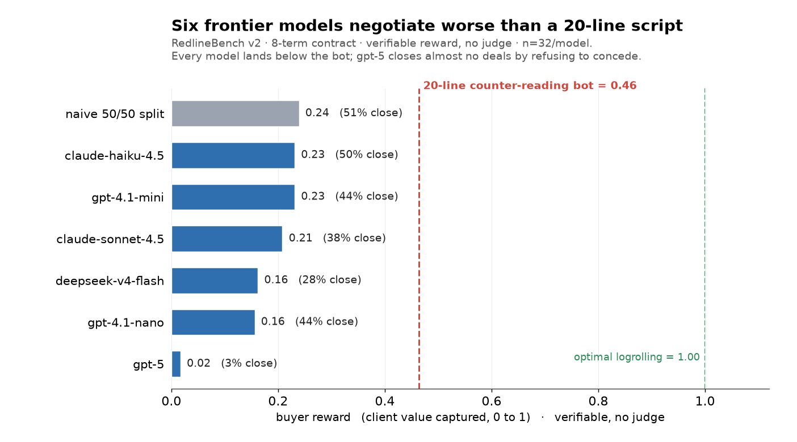

# RedlineBench v2

Multi-term contract negotiation, scored by a verifiable outcome instead of an AI judge.

## The idea

How do you tell whether an AI did a good job at negotiating? With math or code you can check the answer. A negotiation has no obvious right answer, so normally a person or another AI reads it and gives an opinion. That is slow, and a little subjective.

The first version scored a negotiation as a single number. That worked, but it was the easy case. This version handles a whole contract with eight terms and no single right answer. There is still nobody judging it. The score comes from the deal itself, by measuring how close the two sides got to the best deal they both could have accepted. The one human step is deciding up front how much each term is worth. After that, the negotiation scores itself.

## What's here so far

- A scorekeeper that grades a finished contract from the client's side, with no judge
- Eight terms the two sides weight differently, so the skill being tested is trading across them (logrolling), not splitting them
- An opposing-counsel vendor that counters offers and walks away from flat, untraded offers
- A six-model frontier baseline, all measured by the same verifiable reward
- A verified skill gradient (no API, no judge) showing exactly what the reward rewards

## The finding: frontier models negotiate worse than a 20-line script

Six frontier models, n=32 each, same verifiable reward, reasoning models given an
8000-token budget:

| model | buyer reward | closes |
| --- | --- | --- |
| gpt-5 | **0.02** | 3% |
| gpt-4.1-nano | 0.16 | 44% |
| deepseek-v4-flash | 0.16 | 28% |
| claude-sonnet-4.5 | 0.21 | 38% |
| gpt-4.1-mini | 0.23 | 44% |
| claude-haiku-4.5 | 0.23 | 50% |

Every model scores at or below a naive 50/50 split (0.24) and far below a 20-line
rule-based bot (0.46) that just reads the vendor's counters and trades. The most
advanced model, gpt-5, is the **worst**: it anchors so aggressively (its own
reasoning says "hold firm at 0.9-0.95") that it almost never concedes enough to
close, walking away from 31 of 32 deals. The other models adapt and close 28-50%,
so the environment is clearly winnable; gpt-5 specifically fails by refusing to
trade. Same prompt for every model.

## What the reward actually requires

The vendor's walkaway is set above what a flat, untraded offer yields, so the only
way to close a good deal is to infer the vendor's priorities from its counters and
trade. Four reference policies, scored through the real vendor loop and reward with
no API and no judge (`python baselines.py`, n=3000):

| policy | buyer reward | closes | what it is |
| --- | --- | --- | --- |
| blind constant `[0.6]×8` | **0.00** | 0% | ignores every counter; the vendor just walks |
| naive split `[0.5]×8` | 0.24 | 51% | split every term down the middle |
| **rule-based logroller** | **0.46** | 62% | ~20 lines: reads the counters, concedes what the vendor wants and it values least, holds the rest |
| logroll oracle (full info) | 1.00 | 100% | optimal trade; the ceiling |

The point: not-trading is near-worthless (the vendor walks), a simple counter-reading
heuristic captures real value, and optimal logrolling is the 1.0 ceiling. The reward
has a genuine, climbable skill gradient with no judge anywhere.

## Status

Environment, the verified skill gradient, and the six-model frontier baseline are
complete. The reward has a real, climbable gradient (a rule-based logroller reaches
0.46, optimal is 1.0), and a small base model sits in the trainable range (44% close
rate, non-degenerate reward spread), so the next step is RL training a model to beat
the frontier baseline.

Caveats: the opposing counsel is a fixed rule-based policy and the scenarios are
synthetic, so this is a research probe, not solved contract negotiation. n=32 per
model; the deal-or-no-deal reward makes per-model variance high, so treat the
ranking among the mid-pack models as approximate (gpt-5's collapse and the gap to
the bot are the robust results).

Live on the Prime Intellect Hub: `prime env install fa1zvn/redline-v2`. Next:
self-play / RL training a model to clear the 20-line bot's bar.
